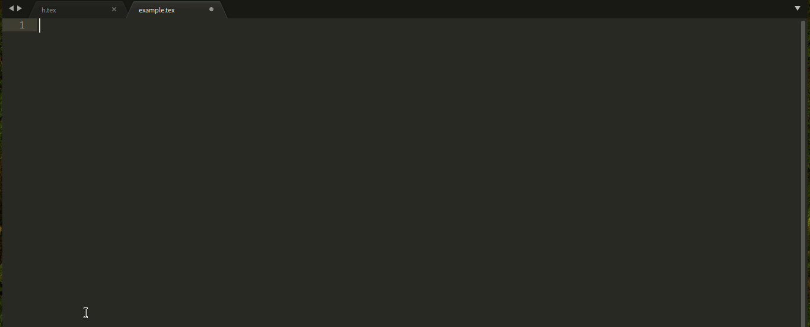

# snippets for LaTeX

You need install "Code Snippets Helper".

## example
```latex
\documentclass[tikz]{standalone}
\standaloneconfig{border=5pt}
\usepackage{xeCJK}
\begin{document}
  \begin{tikzpicture}
    \draw [-latex] [red] (0,0,0)--(4,0,0) node [right] {$x$};
    \draw [-latex] [blue] (0,0,0)--(0,2,0) node [above] {$y$};
    \draw [-latex] [cyan] (0,0,0)--(0,0,2) node [below] {$z$};
    \draw [domain=0:pi,smooth,samples=220,variable=\x,rotate around x=10] plot (\x,0,{sin(4*\x r)});
  \end{tikzpicture}
\end{document}
```



"LaTeX Snippets" can provide more snippets.
